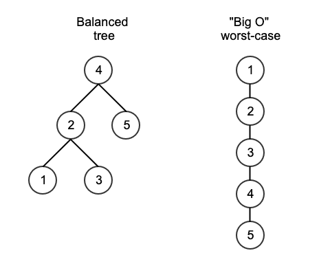
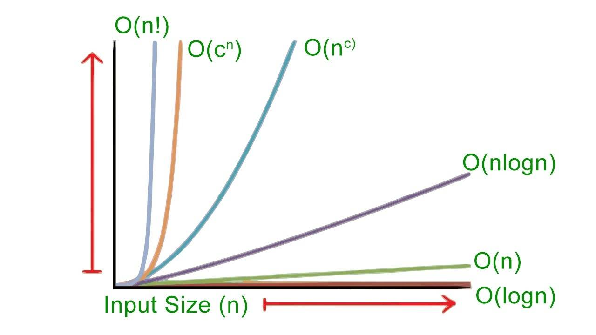

## Introduction

Essentially, "Big O" is the worst-case usage of time or space of a problem in relation to the size of input.  For instance, for a tree problem, one would usually assume that the tree is unbalanced and looks like a single branch to evaluate "Big O," because the single branch often leads to the worst case performance of an algorithm.

In the diagram above, for a well-balanced tree (on the left), it may take "log(n)" time to find node "5" but in the worst-case scenario it would take "n" time to iterate through every single node in the tree.

There aren't that many types of complexity.  We can assume that "n" indicates the length of the input, and implicitly any runtime can be assumed to be multiplied by some constant factor k.  O(n) is the same as O(2*n), O(3*n), O(4*n), O(k*n) etc.,  Here are some common time-space complexities:

    * Linear. O(n) - Most optimal algorithms run in linear time.  An easy way to identify this is to determine if you're visiting every node or item once and only once.  If you are, it is linear... it doesn't matter how many operations you're doing whether it's 1, 2, 3, or 4 lines of code you're executing per node.  Generally, you are still doing a constant amount of work per input.

    * Constant.  O(k) - Constant time algorithms have a running time independent of the input size.  Mathematical formulas for instance have fixed running times and are considered constant time.

    * Logarithmic. O(log(n)) - Logarithmic algorithms are often seen in trees.  It's best to think of "logarithmic" as the "height of the tree."  So, a binary search, for instance, often includes traversing down the height of a tree and can be considered logarithmic in time.  (Although, it may still be more accurate to say that for an unbalanced tree, the runtime is in the worst case linear.)

    * Superlinear. O(n*log(n)).  Most sorts operate in "n log n" time.  This includes popular sorting algorithms like quicksort, mergesort, or heapsort.  (Actually, quicksort is O(n2) time in the worst-case scenario generally).

    * Quadratic or Cubic / Polynomial. O(n2) or O(n3).  Brute force algorithms often run in O(n2) or O(n3) time where you may be looping within a loop.  It's easy to identify if you see a for-loop inside a for-loop, where for each element i you iterate through another element j, for instance.  A common scenario is, given two arrays, find the common elements in each array where you would simply go through each element and check whether it exists in the other array.  This would execute in O(n*m) time, where n and m are the sizes of each array.  It's still great to name these brute force algorithms if you can identify them.

    * Exponential. O(2n).  Exponential algorithms are quite terrible in running time.  A classic example is determining every permutation of a set of n bits (it would take 2n combinations).  Another example is computing the fibonacci sequence fib(n) = fib(n-1) + fib(n-2), where for each item, it requires the computation of two more subproblems.

    *  Factorial. O(n!).  These algorithms are the slowest and don't show up that often.  You might see this in combinatorial problems, or like a "traveling salesman" problem where given n nodes, you need to find the optimal path from start to finish.  In your first iteration, you have a selection of n cities to visit, then n-1 cities, then n-2 cities, n-3 cities, etc., until you reach the last city.   That runtime is n * (n -1 ) * (n - 2) * (n -3 ) ... 1 = O(n!).

A lot of candidates get stuck here by either getting too deep in nitty gritty details and overcomplicating this like saying "This is O(3 * k *  n2), where k is the number of comparisons..." Most software engineers don't care about this level of detail, and you can often get away with simply saying "This is quadratic time because we have two for-loops, each one iterating from 1 to n."

One more tip - do not say "This is O(m + v + e)," when you haven't defined what m, v, or e are.  You generally want to say "... where m is the height of the matrix, v is the number of vertices, e is the number of edges, etc.,"  Once you start reciting formulas without defining the constants you're using, your analysis will appear amateurish.

Most interviewers will focus on time-complexity, but it is great to also consider space-complexity too.  Algorithms are commonly tradeoffs between time and space.  For instance, you may be able to take a polynomial algorithm and convert it to an O(n) algorithm, but it requires creation of a hashmap of size O(n).  That's a good trade-off to be able to talk about because additional space is needed.